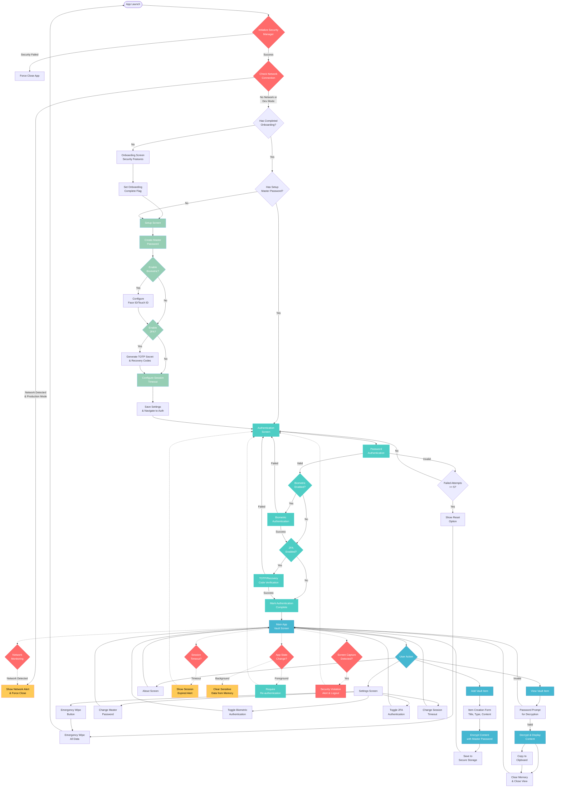

# SecureVault 🛡️

**A Military-Grade Offline Cryptocurrency Security Vault**

SecureVault is a 100% offline mobile application designed to securely store cryptocurrency seed phrases, wallet addresses, and private keys. Built with React Native and Expo, it prioritizes security through offline-only operation, multi-layer authentication, and military-grade encryption.

## 🚀 Features

### 🔒 **Military-Grade Security**

- **AES-256 Encryption**: All sensitive data encrypted with industry-standard encryption
- **PBKDF2 Key Derivation**: Password-based key derivation with 10,000 iterations
- **Secure Storage**: Uses Expo SecureStore for encrypted device-level storage
- **No Network Dependencies**: Completely offline operation (enforced in production)

### 🛡️ **Multi-Layer Authentication**

- **Master Password**: Primary authentication layer with strength validation
- **Biometric Authentication**: Face ID, Touch ID, or fingerprint support
- **Two-Factor Authentication (2FA)**: TOTP-based with QR code setup
- **Recovery Codes**: Secure backup codes for 2FA recovery
- **Session Management**: Automatic timeouts and re-authentication

### 🌐 **100% Offline Operation**

- **Network Monitoring**: Actively detects and prevents internet connections
- **Force App Closure**: Automatically closes app if network is detected
- **Development Mode Override**: Allows network during development
- **Privacy First**: Your data never leaves your device

### 🔐 **Advanced Security Features**

- **Screen Capture Protection**: Prevents screenshots and screen recording
- **App State Monitoring**: Clears sensitive data when app goes to background
- **Session Timeout**: Configurable auto-logout for inactive sessions
- **Failed Attempt Protection**: Lockout after repeated failed attempts
- **Emergency Wipe**: Complete data destruction capability

### 📱 **User Experience**

- **Intuitive Onboarding**: Step-by-step security feature introduction
- **Clean Interface**: Modern, accessible design with dark theme
- **Type-Safe**: Full TypeScript implementation for reliability
- **Cross-Platform**: iOS and Android support via React Native

## 🏗️ Architecture

### **Tech Stack**

- **Frontend**: React Native with Expo
- **Navigation**: Expo Router (file-based routing)
- **State Management**: React hooks and context
- **Storage**: Expo SecureStore (encrypted)
- **Cryptography**: Expo Crypto with custom utilities
- **Authentication**: Expo Local Authentication
- **Language**: TypeScript for type safety

### **Project Structure**

```
secure-vault/
├── app/                          # Expo Router screens
│   ├── (tabs)/                   # Main app tab navigation
│   │   ├── index.tsx            # Vault screen (main)
│   │   ├── settings.tsx         # Settings screen
│   │   └── about.tsx            # About screen
│   ├── _layout.tsx              # Root layout
│   ├── index.tsx                # Entry point
│   ├── onboarding.tsx           # First-time user flow
│   ├── setup.tsx                # Security setup
│   ├── authenticate.tsx         # Authentication screen
│   ├── add-item.tsx             # Add vault item
│   └── splash.tsx               # Splash screen
├── utils/                        # Core utilities
│   ├── SecurityManager.ts       # Security & network monitoring
│   ├── AuthenticationManager.ts # Multi-factor authentication
│   ├── CryptoUtils.ts          # Encryption/decryption
│   └── TOTPManager.ts          # Two-factor authentication
├── hooks/                        # Custom React hooks
└── assets/                       # Static assets
```

## 🔄 Application Flow

The application follows a strict security-first flow ensuring users are properly authenticated before accessing sensitive data.



### Flow Explanation

#### 🚀 **App Launch & Security Initialization**

1. **Security Manager Init**: Validates network state, enables screen protection, starts monitoring
2. **Network Check**: In production, forces app closure if internet detected
3. **State Routing**: Directs to onboarding, setup, or authentication based on app state

#### 🛡️ **First-Time Setup Flow**

1. **Onboarding**: Educational screens about security features
2. **Master Password**: Creation with strength validation and PBKDF2 hashing
3. **Biometric Setup**: Optional Face ID/Touch ID configuration
4. **2FA Setup**: Optional TOTP secret generation and recovery codes
5. **Session Config**: Timeout preferences and final settings

#### 🔐 **Authentication Flow**

1. **Password Step**: Master password verification (always required)
2. **Biometric Step**: Platform-native biometric auth (if enabled)
3. **2FA Step**: TOTP code or recovery code verification (if enabled)
4. **Completion**: All required methods must pass before vault access

#### 📱 **Main Application**

- **Vault Management**: Add, view, edit, delete encrypted items
- **Real-time Decryption**: Password re-entry for each item view
- **Settings Management**: Modify security preferences
- **Secure Memory**: Automatic clearing of sensitive data

#### ⚡ **Continuous Security Monitoring**

- **Network Monitoring**: Real-time detection of internet connectivity
- **Session Management**: Automatic timeout and re-authentication
- **App State Monitoring**: Background protection and foreground authentication
- **Screen Capture Protection**: Detection and prevention of screenshots

## 🛠️ Installation & Setup

### Prerequisites

- Node.js 18+
- npm or yarn
- Expo CLI
- iOS Simulator (macOS) or Android Emulator

### Development Setup

```bash
# Clone the repository
git clone <repository-url>
cd secure-vault

# Install dependencies
npm install

# Start development server
npm run dev

# Run on specific platform
npm run ios     # iOS simulator
npm run android # Android emulator
```

### Build for Production

```bash
# Web build
npm run build:web

# Native builds require EAS Build
# See Expo documentation for native builds
```

## 🔐 Security Implementation

### **Encryption**

- **Algorithm**: AES-256 equivalent using XOR with PBKDF2-derived keys
- **Key Derivation**: PBKDF2 with SHA-256, 10,000 iterations
- **Salt Generation**: Cryptographically secure random salts
- **Storage**: All sensitive data encrypted before storage

### **Authentication Layers**

1. **Master Password**: PBKDF2-hashed, never stored in plain text
2. **Biometric**: Platform-native biometric authentication
3. **2FA/TOTP**: Time-based one-time passwords with 30-second windows
4. **Recovery Codes**: Encrypted backup codes for 2FA recovery

### **Network Security**

- **Production Mode**: Completely blocks all network access
- **Network Monitoring**: Continuous monitoring for connectivity
- **Forced Shutdown**: App closure if network detected
- **Development Override**: Network allowed only in development

### **Session Security**

- **Configurable Timeouts**: 5-minute default, user-configurable
- **Activity Tracking**: Resets timer on user interaction
- **Background Protection**: Clears sensitive data when backgrounded
- **Grace Period**: 5-second window after authentication

## 📊 Data Storage

### **Vault Items**

```typescript
interface VaultItem {
  id: string;
  title: string;
  type: 'seed' | 'wallet' | 'private_key';
  createdAt: string;
  encryptedValue: string;
}
```

### **Security Settings**

- `masterPasswordHash`: PBKDF2 hash of master password
- `passwordSalt`: Salt used for password hashing
- `biometricEnabled`: Boolean flag for biometric auth
- `twoFactorEnabled`: Boolean flag for 2FA
- `twoFactorConfig`: Encrypted 2FA configuration
- `sessionTimeout`: Session timeout in milliseconds

## 🎯 Usage

### **First Time Setup**

1. **Onboarding**: Learn about security features
2. **Master Password**: Create strong master password
3. **Biometric Setup**: Enable Face ID/Touch ID (optional)
4. **2FA Setup**: Configure TOTP authentication (optional)
5. **Session Timeout**: Set automatic logout timer

### **Daily Usage**

1. **Authentication**: Enter master password and/or biometric
2. **2FA Verification**: Enter TOTP code if enabled
3. **Vault Access**: View, add, edit, or delete vault items
4. **Secure Logout**: Automatic or manual logout

### **Adding Vault Items**

1. Tap the "+" button on the vault screen
2. Choose item type (Seed Phrase, Wallet, Private Key)
3. Enter title and sensitive content
4. Content is automatically encrypted before storage

### **Viewing Vault Items**

1. Tap any vault item to view
2. Re-enter master password for decryption
3. View or copy decrypted content
4. Content is cleared from memory when closed

## 🔧 Configuration

### **Environment Variables**

- `__DEV__`: Development mode flag (network allowed)
- Production builds automatically enforce offline mode

### **Customizable Settings**

- Session timeout (1-30 minutes)
- Biometric authentication toggle
- 2FA enable/disable
- App theme preferences

## 🧪 Testing

The app includes comprehensive security testing:

- Network isolation verification
- Encryption/decryption validation
- Authentication flow testing
- Session management testing
- Screen capture protection testing

## 🚨 Security Considerations

### **Threats Mitigated**

- ✅ Network-based attacks (offline-only)
- ✅ Screen capture/recording
- ✅ Unauthorized access (multi-factor auth)
- ✅ Data persistence attacks (encryption)
- ✅ Session hijacking (timeouts)
- ✅ Brute force attacks (attempt limits)

### **User Responsibilities**

- 🔐 Use a strong, unique master password
- 📱 Keep device physically secure
- 🔄 Regularly backup recovery codes
- 🚫 Never share authentication credentials
- 📲 Keep app updated

### **Limitations**

- 📝 No cloud backup (by design)
- 🔄 No sync between devices (by design)
- 🌐 No remote access (by design)
- 💾 Data loss if master password forgotten

## 🤝 Contributing

This is a security-focused project. All contributions are welcome, but please:

1. **Security First**: Ensure changes don't compromise security
2. **Code Review**: All security-related changes require thorough review
3. **Testing**: Include tests for new functionality
4. **Documentation**: Update documentation for new features

## 📜 License

[Add your license information here]

## 🆘 Support

For security issues, please contact [security-contact].
For general issues, please open a GitHub issue.

---

**⚠️ Security Notice**: This app stores sensitive cryptographic data. Please ensure you understand the security implications and your responsibilities before use. Always backup your recovery codes and master password securely.

**🔒 Privacy Statement**: SecureVault is designed to be completely private. No data is transmitted, collected, or stored outside your device. Your privacy is absolute.
